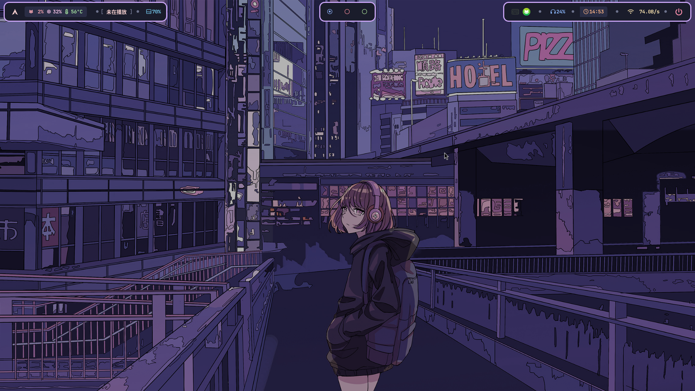
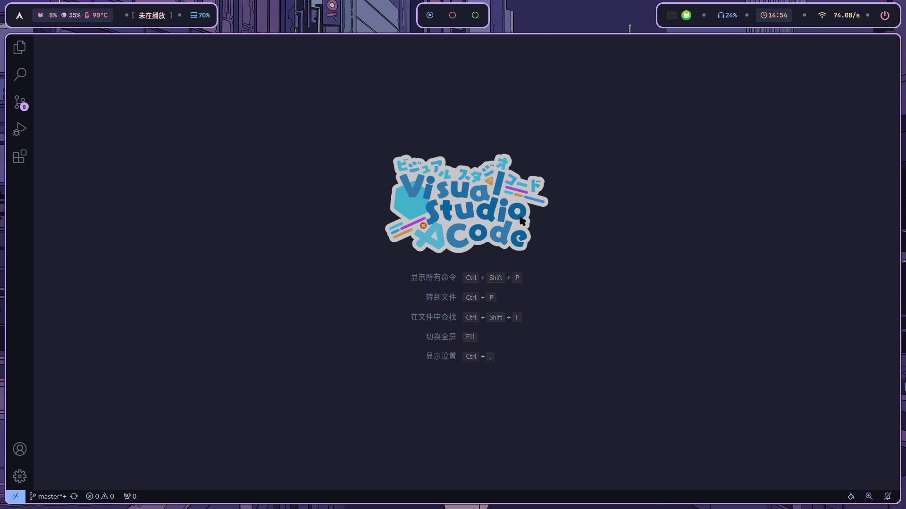
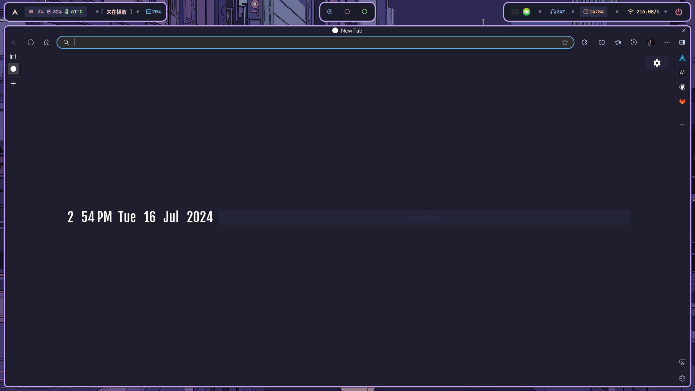
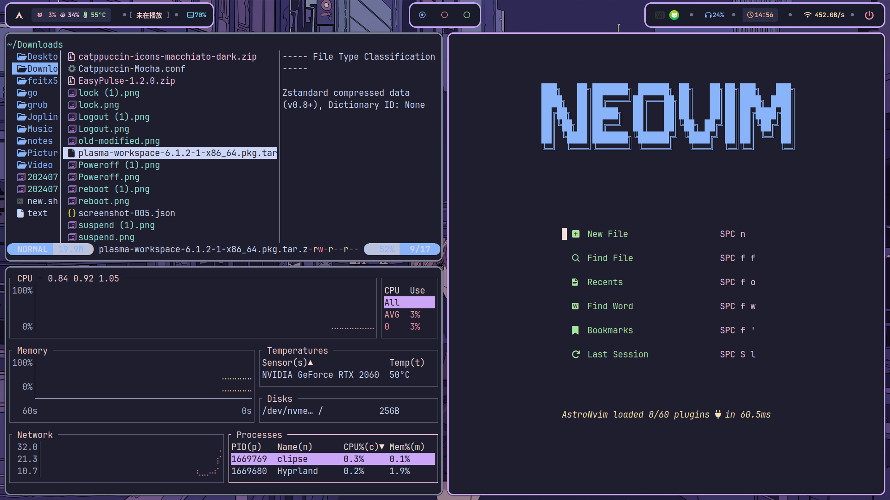
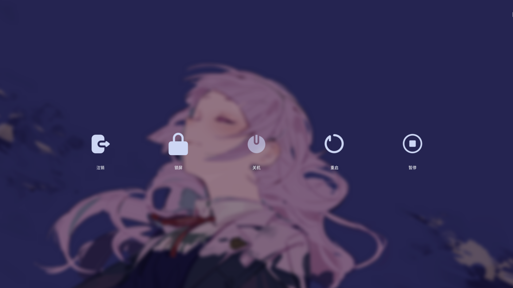
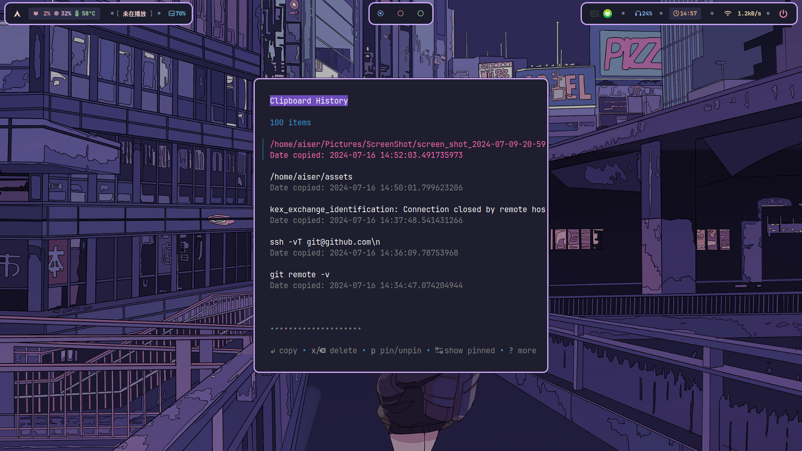
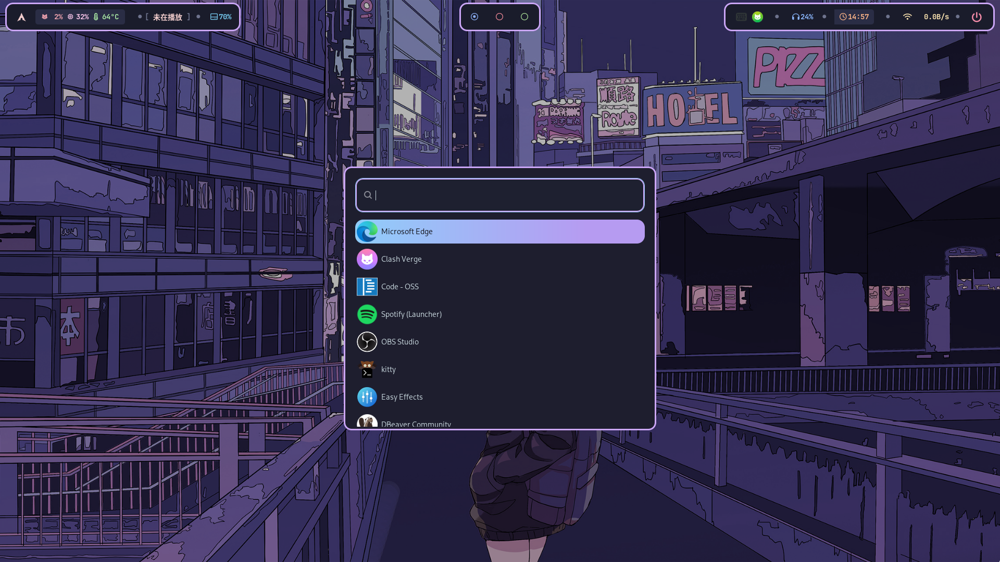

# HyprlandDotfiles
本仓库包含了我日常使用的 Hyprland 环境配置。
## 基本截图
以下截图展示了我的 Hyprland 配置在各种场景下的表现：
### Hyprland 主界面

### Vscode

### Edge浏览器

### 平铺常用应用

### 电源

### 剪切板

### 应用启动器（wofi）

### Hyprland太棒了！
